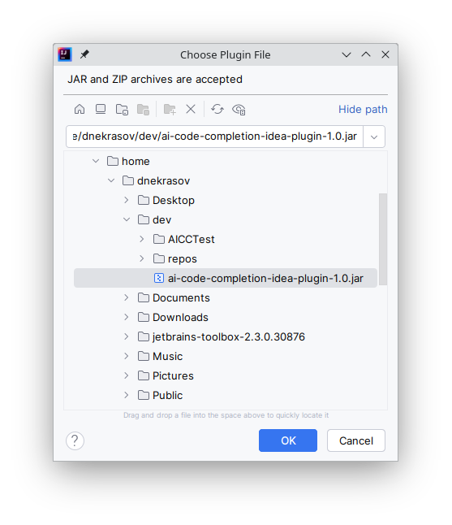

# IntelliJ IDEA AI Code Completion Plugin

Implementation of IntelliJ IDEA code completion plugin using a local LLM.

### Overview

The plugin is designed to enhance the coding experience within an IDE by providing inline code completion suggestions. It operates by analyzing the context around the caret position in the editor, leveraging both a local cache and an external AI model to generate relevant code snippets. These suggestions are presented as gray text directly in the editor, allowing developers to incorporate them into their code with minimal interruption. The plugin's functionality can be summarized in several key steps:

1. **Identification of Context.** When a code completion request is initiated, the plugin identifies the current context by splitting the document text around the caret position into a prefix and suffix. This context is crucial for generating relevant suggestions.
2. **Cache Query.** The plugin first checks its local cache using the prefix and, if available, the last line of the prefix as keys. If a match is found, it is considered a cache hit, and the cached suggestion is used.
3. **AI Model Query.** If no relevant suggestion is found in the cache (a cache miss), the plugin queries an external AI model with the prefix and suffix. The AI model returns a suggestion that is potentially added to the cache for future use.
4. **Suggestion Processing.** The returned suggestion may be adjusted to a single-line format based on certain criteria evaluated by the `AICCStatisticAnalyzer`. This step ensures that the suggestions fit seamlessly into the code without disrupting the coding flow.
5. **Inline Completion Suggestion.** The processed suggestion is then provided to the developer as an inline completion suggestion. This suggestion appears as gray text directly in the editor, offering a non-intrusive way to enhance coding efficiency.
6. **Cache Management.** The plugin also includes functionality to pre-emptively cache suggestions for a smoother user experience. It predicts the next likely input from the user by concatenating the current suggestion to the prefix and querying for a new suggestion based on this new prefix and the original suffix.
7. **Insertion Handling.** After a suggestion is inserted, the plugin records this event for statistical purposes, helping to measure the success and utility of the provided suggestions.
8. **Enablement Check.** The plugin checks whether inline completion should be enabled based on the current context, specifically if the text at the caret position should not be skipped according to predefined criteria.

This plugin aims to streamline the coding process by reducing the need for manual code lookups and typing, thereby increasing developer productivity and code quality.

For more information, you can review the documentation provided in the source code.

### How to use

1. Install local Ollama server. You need to go to the [Ollama website](https://ollama.com/), download and install Ollama for your operating system. An example of how to do this for Linux:
```bash
curl -fsSL https://ollama.com/install.sh | sh
```
2. Check that the Ollama server is available. To do this, follow the link -  [localhost:11434](http://localhost:11434/), you should see the following message in the browser:
```
Ollama is running
```
3. Pull `codellama:7b-code` model:
```bash
ollama pull codellama:7b-code
```
4. Check that the model has been successfully pulled. To do this, run the command:
```bash
ollama list
```
You should see output similar to the following:
```
NAME             	ID          	SIZE  	MODIFIED   
codellama:7b-code	fc84f39375bc	3.8 GB	5 days ago
```
5. Download the latest version of the plugin from the Releases section.
6. Open IntelliJ IDEA, Choose **Settings -> Plugins -> Gear-Icon -> Install Plugin from Disk...**, and select the downloaded plugin.
   
   
<p align="center">
  
</p>
7. Enjoy AI autocompletion!
